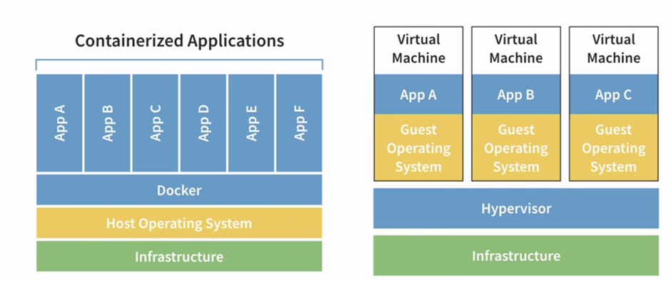
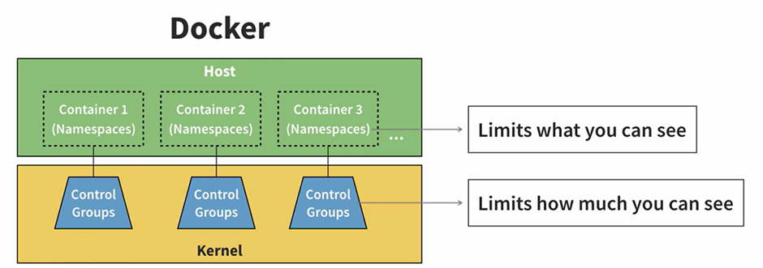

# Quick notes on docker
## Container vs VMs

 
Containers
- Aimed to virtualise/emulate an OS
- Run on container run times (I.e. Docker, podman)
-	Work with VMs to allocate hardware, copy files and directories to run app
-	Do not need to emulate hardware or need to be booted up
-	Do not require any OS installation
-	Apps can start very quickly
-	Take less space as we don’t need to run an OS
-	Can only run one app at a time
-	Can interact with their host 

**To clarify**:
1.	Shared Kernel: Containers are designed to be lightweight by sharing the host machine's operating system kernel. The kernel is the core part of the operating system that manages system resources and hardware. Containers use the same kernel as the host, so they don't need to replicate all the functions of an entire operating system.
2.	Container Runtimes: Container runtimes like Docker or containerd are responsible for managing containers. They package the application code, libraries, and dependencies along with a minimal runtime environment, which includes just enough of the operating system to run the application. This runtime environment is what allows containers to execute code without a full OS. This bundled environment is what we refer to as the "container."

3.	Namespace and Control Groups: Linux provides features like namespaces and control groups (cgroups) that allow containers to create isolated environments for processes within the same host OS. Namespaces provide process isolation, and cgroups control resource allocation (CPU, memory, etc.). These features enable multiple containers to run on the same host without interfering with each other.

So, while containers do rely on an operating system, they do not require a separate, full-fledged OS installation for each container. Instead, they use the host OS's kernel and create isolated runtime environments managed by container runtimes. This approach makes containers highly efficient and allows them to start quickly, as they only need to set up the environment necessary for the specific application they contain. Containers share the host operating system's kernel, and container runtimes like Docker facilitate the creation and management of these isolated environments. Docker, along with other container runtimes, provides the necessary tools and mechanisms to bridge the gap between the host OS and the container.

## VMs
-	Has a hypervisor which emulates real hardware – bridge VMs to hosts
-   Takes up a lot of space
-	Requires you to install/configure the OS
-	Can run multiple apps at the same time
-	Cannot interact with their hosts

## Container structure

 
## Docker commands
-	`Docker run` is short for `docker container create` + `docker container start`  + `docker container attach`
-	`Docker ps` to view active containers, with -a to view all containers
Docker steps
-	Each step in a docker image is an instruction. Depending on the task, it may or may not create an image. These images are called intermediate images. The intermediate images “capture” any changes performed. While each step may not create a new image, it does create a new layer. These layers are compressed to make the final docker image.
-	Docker images act as templates to help spin up docker containers and are often starting points when using docker
-	To achieve this, we use a build command to build docker images and docker run to create containers. If you want to build and run your images, you should build first then run it after.

## Docker servers
-	Dockerfiles that do not immediately exit after running the entrypoint command are called docker servers
-	Building and run docker server files will continue running indefinitely, but we can stop it using `docker kill [container-id]`
-	We can also use docker exec to execute commands inside the container, which is useful for debugging. For example: `docker exec --interactive --tty 32ef748596bd bash`

The above tells docker “we want to execute (exec) commands and allow us to interact (interactive) with the container using our terminal (tty) to this id 32ef748596bd using bash script (bash).

Docker does not stop containers and remove them for you – it’s the dev’s responsibility. You can run `docker stop id` to stop a particular docker container. You can also force the container to stop using `docker stop -t 0 id` but it can lead to data loss, so use sparingly. 

You can run `docker rm` to remove docker containers that are stopped, which helps free up battery usage and your computer’s resources. You can also use the -f flag in docker rm to stop and remove a docker container. You can even remove all docker containers in one go using  `docker ps -aq | xargs docker rm`

Docker ps -aq shows all docker container ids, the takes the output, feeding it to xargs. Xargs is a useful as it allows us to perform actions on a list, similar to a loop. Here we run docker rm to apply the command to each member of docker ps -aq.

## Accessing Container Network Services from Your Host
Docker provides the ability to access network ports within a container using port binding. This allows Docker to map a port on your host machine to a port within the container, acting as an intermediary between your computer and the container itself. This is incredibly useful when packaging applications that rely on specific ports, such as frontend applications running on localhost connected to backend servers.

To build a network service, you need to create a Dockerfile and build an image:


```docker build -t our-web-server -f web-server.Dockerfile .```
Breaking down the command: docker, please build an image in the current directory (.), naming it -t as `our-web-server`, and use the Dockerfile specified with `-f` as web-server.Dockerfile.

Once you've built the image, you can create a container from it:

```docker run -d --name our-web-server -p 5001:5000 our-web-server```
In this command, you're telling Docker to run a container in detached mode (`-d`) with the name `--name` set as `our-web-server`. The container should expose port 5000 internally and map it to port 5001 externally on your host using the `our-web-server` image.

## Saving Data from Containers
In Docker, you can create a container that executes commands and automatically deletes itself when it exits by adding the --rm flag to a docker run command:


`docker run --rm [options]`
You can also create files inside containers by specifying an entrypoint flag:


```docker run --rm --entrypoint sh ubuntu -c "echo 'Hello there.' > /tmp/file && cat /tmp/file"```
In this example, you're running a Docker container, and it will be deleted after it has executed its code. Before deletion, it uses the `ubuntu` image, enters the container with the `--entrypoint` set to sh shell, copies the output of '`Hello there.`' into `/tmp/file`, and then displays the contents of that file.

However, the data will be lost after the container is deleted. To keep a reference, you can link a file on your host machine to a file inside the container:


```docker run --rm --entrypoint sh -v /tmp/container:/tmp ubuntu -c "echo 'Hello there.' > /tmp/file && cat /tmp/file"```
The key part to notice here is the `-v /tmp/container:/tmp` flag. `-v` stands for "volume," and the syntax is `host_file_or_directory:container_file_or_directory`. Ensure that the file on your host machine exists before creating this link, as Docker will create a directory if it doesn't exist.

# Container image registry
A container image registry is a place for storing and tracking container images. Container image tracked by their tags, which is a string combining the name of the image and its version with a semi colon (option). Container images that do no have a version automatically get tagged with a version called "latest". This allows us to select which version of an image we want to use.

You can also push your images to the container registry. First, you should ensure you have a docker account then run `docker login` in your terminal. After that, rename your image to something meaningful, for example:

` docker tag our-web-server your_docker_username_here/our-web-server:0.0.1`

The `tag` command is renaming our image, `our-web-server` to a docker username, followed by its version ( **:** ), 0.0.1. This operation is similar to the linux `mv` command. To push the image, simply run the docker push command:

`docker push your_image_name`, replacing `your_image_name` with the name of your image.

